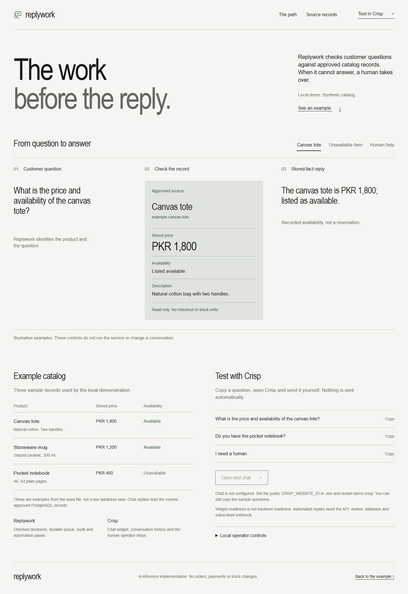
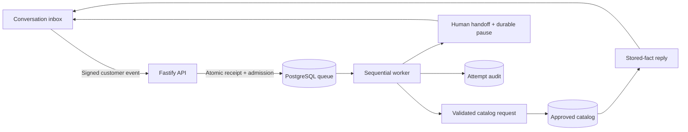

<p align="center">
  
</p>

<h1 align="center">replywork</h1>

<div align="center">
  <p>The work behind the reply.</p>

  <p>Catalog answers from approved records,<br>with a durable path to human takeover.</p>

  <p>Crisp or Chatwoot owns the conversation inbox.<br>Replywork owns the checked decisions and business integration.</p>

  <p><a href="https://github.com/vroslmend/replywork/actions/workflows/ci.yml"></a></p>

  <p><a href="docs/demo.md">Local sample</a> · <a href="docs/architecture.md">Architecture</a> · <a href="docs/crisp.md">Crisp setup</a></p>
</div>

## An answer you can check

Ask **“What is the price and availability of the canvas tote?”** The worker can interpret the
request, look up the approved synthetic product and reply with **PKR 1,800; listed as available**.
The model extracts a bounded request; local code renders stored facts from PostgreSQL. It cannot
invent a price, change stock or place an order.

The retained [interactive sample](examples/crisp/) shows a question, its approved source record and
a reply or handoff decision. Three illustrative paths are labelled as previews, not live runs. The
compact catalog and copyable questions support a deliberately opened Crisp widget below. It is a
localhost test surface, not a real shop or a second helpdesk UI. Its operator section copies scoped
commands rather than exposing database controls.



## Try it

Use Node.js 24 and the repository-pinned pnpm through Corepack:

```sh
corepack pnpm install --frozen-lockfile
corepack pnpm verify
corepack pnpm demo:crisp
```

Open `http://127.0.0.1:3001`. The page renders without a database or credentials. An empty
`CRISP_WEBSITE_ID` leaves chat disabled; Crisp loads only after you open it. No question is sent
automatically. For a real inbox roundtrip, follow the [start-to-stop workflow](docs/demo.md): local
PostgreSQL, a synthetic seed, dedicated Crisp development workspace, API, worker and temporary
tunnel. Nothing needs to be installed on your live portfolio or permanently deployed.

## Current boundary

The repository implements and tests a durable delivery path for Chatwoot and Crisp:

- HMAC verification over the original request body;
- replay-window checks;
- message validation and normalization;
- filtering for private, outgoing, and unsupported messages;
- atomic receipt and queue admission in PostgreSQL;
- a queue worker with visibility timeout, audit records, and archive-on-success behavior;
- outgoing replies through the configured provider API;
- provider-appropriate human handoff with durable local automation pause and trusted resume
  controls.

The default test suite remains offline. Database tests exercise the complete signed webhook to
outgoing API-request path against local PostgreSQL and a controlled HTTP boundary. A Crisp
development workspace has also completed the live Free-plan reference path: inbound delivery, reply,
retry, takeover suppression, resume, and a grounded catalog reply. This is development evidence, not
a production hosting or uptime claim.

## Shape



The API and worker live in one service application. Shared packages hold contracts, business rules,
provider adapters, and test fixtures. This keeps deployment simple while preserving the boundaries
that later integrations need.

## Development

`corepack pnpm verify` runs formatting, lint, source/test type checks and offline tests. Individual
commands are available when working on one layer:

```bash
corepack pnpm format:check
corepack pnpm lint
corepack pnpm typecheck
corepack pnpm test
corepack pnpm build
```

`corepack pnpm worker:once` processes at most one admitted delivery and then exits. Opt-in
`corepack pnpm worker:run` processes sequentially until stopped, waiting between idle reads. Ctrl+C
lets the current delivery finish and closes the connection. A processing failure stops the loop with
a redacted error; correct the problem before deliberately restarting. Run one worker, not concurrent
copies. The recorded live Crisp check used the one-shot worker; the retained page and polling loop
have separate offline and browser checks, not an unattended deployment claim.

Copy `.env.example` to `.env` only when running an integration locally. Unit and contract tests do
not read local credentials or make network requests.

For an existing instance or the optional self-hosted example, see the
[Chatwoot integration guide](docs/chatwoot.md). The example follows upstream documentation but has
not been booted or verified against a live instance. Chatwoot is not required for offline
development.

For the permanent Free-plan development path, see the [Crisp integration guide](docs/crisp.md). Its
signed webhook, API reply, retry and handoff boundaries are covered by offline tests and a
controlled live development-workspace check.

## Catalog

The read-only PostgreSQL catalog lookup returns approved product records with stored prices,
availability and descriptions. It supports bounded text search and exact product IDs, without
inventing missing products or changing business data. A local command and synthetic examples are
available in the [catalog guide](docs/catalog.md). Set `REPLYWORK_RESPONDER=catalog` to let the
worker answer explicit `/catalog` requests from recorded facts and hand off other requests. Fixed
replies remain the default. Opt-in `catalog-natural` mode uses Gemini to extract a bounded catalog
request, then builds the answer from stored facts. Evaluate the selected model with synthetic
questions before using it with customer messages. The
[terminal question command](docs/catalog-questions.md) checks interpretation and factual replies
without a conversation provider. Handoff pauses automation until an operator explicitly resumes it.
See the [conversation control guide](docs/conversation-control.md) for behavior and limits.

## Scope and security

This is a read-only catalog vertical slice, not a commerce dashboard. Products are synthetic seed
data and availability is a recorded value, not a stock reservation. Orders, payments, refunds,
policy automation, memory, automatic operator detection and multi-tenant catalogs are not
implemented. Unsupported work goes to a human. Natural mode is opt-in and sends the current question
to Google's API; offline checks do not read keys or contact model providers.

If transactional actions are introduced later, deterministic validation, identity checks and
explicit confirmation or operator approval must guard them. A model cannot grant its own permission.

Please report security problems privately as described in [SECURITY.md](SECURITY.md).

## Licence

Inspection and non-commercial use are covered by [LICENSE.md](LICENSE.md). Commercial use and
competing hosted copies require prior written permission. The original Replywork SVG mark is
maintained in this repository.
